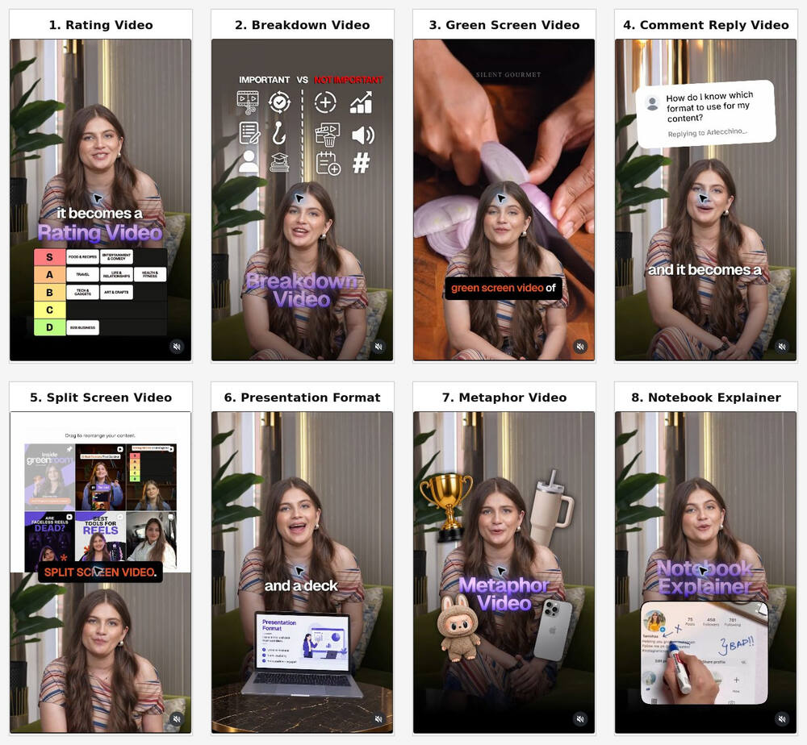

# Short-Form Video Format Library

This is the canonical, company-agnostic reference for selecting a short-form video structure before scripting or storyboarding. Brand-specific skills should reference this file and add only their own audience, claims, assets, approvals, and production constraints.

## How to use this library

1. Identify the communication job: rank, organize, react, answer, compare, teach, clarify, or annotate.
2. Choose one primary format whose visual structure helps deliver that job.
3. Build the hook, script, and storyboard around the format. Do not treat the format as decoration added after the script.
4. Use a hybrid only when the secondary format makes the idea easier to understand.
5. For format-specific treatment, read the matching format section below before writing the storyboard.

## Format catalog

| Format | Best when | Core structure | Required inputs | Common failure |
| --- | --- | --- | --- | --- |
| **Rating Video** | Ranking tools, tactics, examples, features, or trends | Introduce the criteria, place each item on a visible tier or scorecard, then explain the most consequential placements | Items to rank, clear criteria, tier list or scorecard graphic | Ranking feels arbitrary because the criteria are missing |
| **Breakdown Video** | Reframing why something is not working, clarifying a message, or organizing a broad topic | Creator-led hook → tension/proof → full-screen reframe → simple visual system → payoff/CTA | Presenter footage or voice, exact spoken cues, one or two supporting visual systems | Graphics repeat narration, arrive late, or turn into a generic presentation |
| **Green Screen Video** | Reacting to or explaining footage, a webpage, screenshot, product, or cultural reference | Put the source visual behind the presenter while the narration points out what viewers should notice | Relevant source media with permission to use it | Background is generic, unreadable, or unrelated to the spoken line |
| **Comment Reply Video** | Answering a real audience question or objection | Open with the comment bubble, acknowledge the question, then answer directly with proof or an example | Real comment or accurately recreated question | The question is only a gimmick and the answer does not resolve it |
| **Split Screen Video** | Comparing examples or keeping a presenter visible alongside a demo, proof, or reference | Give the evidence panel visual priority; use the presenter as an active supporting panel | Presenter footage plus a legible demo, example, or screen recording | Both panels compete for attention or important content becomes too small |
| **Presentation Format** | Teaching a structured lesson, framework, process, or data-backed argument | Presenter narrates alongside a deck, chart, diagram, or sequence of visual aids | Concise slides or diagrams designed for phone viewing | Desktop slides are shrunk until the text is unreadable |
| **Metaphor Video** | Making an abstract idea, tradeoff, or comparison immediately tangible | Assign meaning to recognizable physical objects and use them to demonstrate the idea | Props with an obvious visual relationship to the concept | The metaphor needs more explanation than the original idea |
| **Notebook Explainer** | Annotating a screenshot, diagram, account, funnel, interface, or process | Use an overhead or close-up view while a hand writes, circles, connects, or labels the important details | Printable visual or tablet/notebook canvas and a clear annotation sequence | The writing is too small, fast, or decorative to teach anything |

## Breakdown Video — creator-led editorial treatment

Use this format for a fast, social-native explanation in which a creator's direct-to-camera delivery is the spine and graphics make the argument easier to understand. It is not a split-screen format: switch between full-screen presenter moments and full-screen graphic moments when each earns the canvas.

### Bubble production reference

For Bubble videos, use the [Bubble breakdown production reference](https://github.com/emmeliedelacruz/Bubble/blob/main/marketing/bubble-ad-video/references/breakdown-videos.md) through [Bubble Ad Video](https://github.com/emmeliedelacruz/Bubble/blob/main/marketing/bubble-ad-video/SKILL.md). It preserves Bubble's approved colors, typography, graphic components, and motion while adapting to each new recording. This library remains company-agnostic and owns general format logic; the Bubble reference owns that brand's execution.

### Styling rules

- Build the edit around the argument, not an arbitrary sequence of graphics: hook → tension → reframe → payoff → CTA.
- Tie every visual entrance to the exact word or short phrase it explains. A label or card that lands after the spoken cue is decorative, not explanatory.
- Keep a meaningful visual change roughly every 0.7–1.7 seconds: a punch-in, full-screen cutaway, card transformation, new label, or return to the creator. Do not add motion that does not clarify the spoken point.
- Keep direct-to-camera for personal, rhetorical, or high-stakes lines. Use a full-screen visual interruption for contrasts, systems, proof, or abstract reframes that need the whole canvas.
- Use one dominant visual idea per beat. Treat text, labels, icons, and UI-like cards as editorial devices—not as a miniature slide deck.
- Create only the support needed to make the claim legible. If a product, post, page, or result is evidence, use an approved real source rather than an invented facsimile.

### Recommended 15-second edit map

| Beat | Editorial move | Visual treatment |
| --- | --- | --- |
| Hook | State the tension or recognition point | Full-screen creator; a small phrase near the shoulder, not a giant headline block |
| Tension | Make the cost or problem concrete | Slight punch-in on the key noun or verb; one simple proof card or counter |
| Reframe: “not X” | Name the mistaken focus | Full-screen graphic; show X as a small labeled system, then cross it out or de-emphasize it |
| Reframe: “it is Y” | Put the real focus in the foreground | Matching full-screen system; make Y dominant and show only one or two examples |
| Payoff | Explain the useful principle | Return to the creator; land one compact question, message, or value card |
| Application | Show how the principle travels | Transform that card into the message/source, then introduce the relevant outputs or channels one at a time on the spoken cadence |
| CTA | Let the next step land | Briefly hold the payoff, then hard-cut to the supplied end card or CTA scene |

### Readability and transition discipline

- Design for vertical 9:16 phone viewing. Use the downstream brand or workflow's safe-area specification; if none exists, keep generous side and top/bottom margins.
- Re-line copy before reducing its size. Never crop, truncate, or scale down a word until it is hard to read.
- Keep captions out of faces and out of functional UI or proof. Do not stack routine captions over a designed CTA.
- At every cut, fully remove or cover the prior visual before the next arrives. Inspect both sides of the transition in the actual exported video.
- Let each graphic land long enough to be understood, then clear or transform before the next spoken idea.

## Split Screen Video — layout treatment

Use split screen when the presenter and a supporting visual genuinely need to remain visible at the same time. It is a distinct format from a Breakdown Video, not an automatic add-on to it.

### Layout rules

- Give one panel a clear job and visual priority. Usually the demo, example, proof, or reference is primary; the presenter supplies context and narration.
- In vertical 9:16, start with the evidence in the upper ~45% and the presenter in the lower ~55%. Use 50/50 only when both panels need equal visual weight.
- Crop the supporting visual to the action viewers need to see; do not shrink a whole desktop screen into an unreadable panel.
- Keep the presenter framed cleanly with sufficient headroom. Put captions in the presenter panel when possible, away from the face and away from the divider.
- When the supporting visual needs close inspection, switch to a full-screen cutaway instead of forcing it into a split screen.
- Use a subtle divider only when it improves separation. The layout should read as one composition, not two competing videos.
- Cut in and out cleanly: the incoming panel must cover its area from its first frame, with no source-aspect edge, stale frame, or presenter leak.

## Selection guide

| Communication job | Start with |
| --- | --- |
| Rank choices or express a point of view | Rating Video |
| Organize a messy topic | Breakdown Video |
| React to existing media or show context | Green Screen Video |
| Answer a known audience question | Comment Reply Video |
| Compare multiple examples or show proof while speaking | Split Screen Video |
| Teach a structured framework | Presentation Format |
| Explain an abstract idea quickly | Metaphor Video |
| Walk through details by marking them up | Notebook Explainer |

## Shared production principles

- Design for a vertical 9:16 canvas and phone-size viewing.
- Show the format's visual premise early enough that it contributes to the hook.
- Keep one dominant visual idea per scene.
- Make labels, UI, and examples large enough to understand without pausing.
- Match every visual to the words being spoken; unrelated B-roll is not a substitute for structure.
- Keep captions clear of faces, product UI, diagrams, and baked-in text.
- Preserve the full payoff state of animations and demonstrations.
- Review the finished edit with sound and inspect every transition boundary.

## Referencing this from another skill

Downstream company or workflow skills should link to this file as the source of truth rather than copying the catalog. In those skills, instruct the agent to select the format and read its matching section here before scripting, storyboarding, or editing; then apply the downstream skill's brand, claims, assets, approvals, and production constraints.

Canonical GitHub URL:
`https://github.com/emmeliedelacruz/Ai-skills/blob/main/creative-director/video-formats.md`

## Source example

The initial eight-format set was documented from [this Instagram Reel](https://www.instagram.com/reel/Dc7qNYFhFMc/) by Tanishaa Bhansali. The reusable guidance above is generalized so it can support different brands, subjects, and production workflows.
